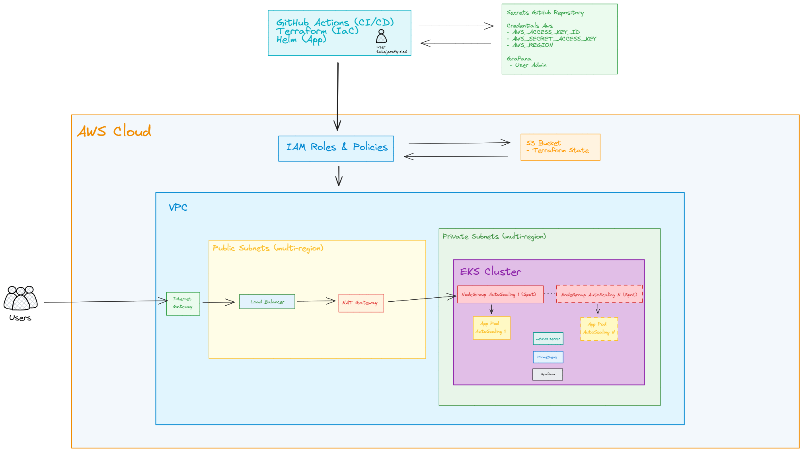

# TabajaraFy IaC Architecture

This project provisions a complete, production-ready AWS infrastructure for Kubernetes workloads, with automated deployment and observability.

## Components

- **VPC & Networking:** Multi-AZ VPC, public/private subnets, NAT Gateway, Internet Gateway.
- **EKS Cluster:** Managed Kubernetes control plane.
- **Node Groups:** Spot and on-demand EC2 nodes for cost. (Can be On-demand for reliability)
- **IAM Roles:** Least-privilege for EKS, nodes and Autoscaler.
- **Helm Deployments:**
	- Nginx application (with HPA, rolling updates, anti-affinity).
	- kube-prometheus-stack (Prometheus + Grafana).
 **CI/CD:** GitHub Actions for full automation.
 **Testing:**
	 - Stress and failure simulation scripts (Python, node failure script).
	 - Autoscaling validation (HPA).
	 - Metrics-server for resource metrics.

## Architecture Diagram

## Workflow

1. **Provisioning:** Terraform creates all AWS resources and outputs cluster info.
2. **Deployment:** GitHub Actions pipeline runs Helm to deploy app and monitoring.
3. **Observability:** Prometheus scrapes metrics; Grafana visualizes them (auto-configured data source).
4. **Scaling:** HPA and Cluster Autoscaler ensure right-sizing and automatic scaling of pods and nodes.
5. **Testing:**
	- Stress tests (Python script) generate load to trigger HPA autoscaling.
	- Node failure simulation script validates pod rescheduling and cluster recovery.
	- CI/CD pipeline runs automated smoke tests after deployment.

## Security

- IAM roles with least privilege.
- Security Groups restrict access to only required ports.
- RBAC Cluster.

## Cost Optimization

- Spot instances for workloads.
- Autoscaling and right-sized resources.

---